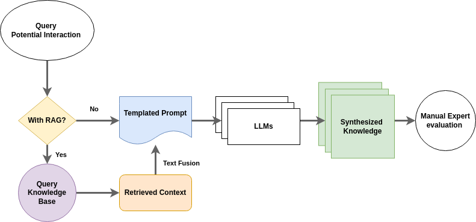

# Overall process description:



------------
# Project Description:
Hi everyone, 

I'm Israel Dilan, a graduate student at the University of Pittsburgh's biomedical informatics program. I work in the TRIADs Lab, our research focuses on advancing natural product-drug interaction research with the help of AI tools. The work I'll share with you today centers around exploring large language models' Knowledge Augmentation Strategies for Natural Product Drug Interaction Research. Here, we explore LLMs with Retrieval-Augmented Generation (RAG) as a knowledge synthesis tools.

What do we mean by this?

Pharmacological interactions involving natural products can be complex, and studying them often involves gathering bits of evidence and knowledge from multiple domains. For example, the study of a potential interaction, such as the increase of INR levels from a cranberry-warfarin interaction, might necessitate finding the relevant intersection between botanical, pharmaceutical, and clinical research, as well as other domains. LLMs can synthesize knowledge resources that compile relevant evidence and information and potentially surface additional interaction mechanisms. Nonetheless, the extent to which we can rely on the reasoning capabilities of LLMs remains unclear. Additionally, how well RAG addresses the potential for hallucinations is also unclear.

To explore the capabilities, we designed two experiments. The first was where the models could only use their parametric knowledge. And a second one in which the models were allowed to combine their parametric knowledge with additional context retrieved from an in-house knowledge base. In both experiments, all models were provided the same prompt. The responses were expected to adhere to a provided template, representing the information needs of a user persona derived from prior work that proposed three user personas generated for the drug-drug interaction specialist, pharmaceutical researcher, and drug compendium editor, all focused on Natural Product-Drug interactions. The responses generated by the LLMs were evaluated for their Completeness and Quality: Where completeness represents how well the response manages to fill the template items. Quality represents a set of observations regarding the factuality and information density of the items in the response.

We used a Likert-like scale for the evaluations, and scoring was assigned based on a pharmaceutical expert's annotation of the responses. We attempted to evaluate seven models, but only four were successful: LLama-3.1, Gemma-2, GPT-4o-mini, and Mistral. We suspect the limited context window size negatively affected the other three models. Due to hardware limitations, the models selected range from 7 to 10 Billion parameters (except for GPT-4o-mini, for which the number of parameters is not public).

In the baseline evaluation, Llama 3.1 performed best in completeness and quality, with Mistral performing similarly. During the RAG evaluation, our results indicate a trade-off between Completeness and Quality when using RAG. Most models' completeness decreases, but their quality increases. In this case, the best-performing model in completeness and quality was the GPT4o-mini.

In future work, we seek to explore the effects of additional augmentation strategies, improved prompting, and the usability of the generated knowledge resources.

Thank you!
-----------------
# Evaluation:

Each criteria was scored between 0-4, where a score of 0 represents a complete failure of the response to address the given evaluation item and a score of 4 represents that the model's response fully satisfied the item.

## Completeness Criteria:
- Does the source contain all the relevant BG? _(Max: 4 * 5 = 20)_
    - Pharmacokinetic Properties (NP) 
    - Pharmacokinetic Properties (Drug)
    - Can the NPDI be extrapolated to other NPs? 
    - Can it be extrapolated to other Drugs? 
    - Documentation? 
- Does the source contain an evaluation of Risk? _(Max: 4 * 3 = 12)_
    - Overlapping Effects 
    - Frequency/Likelihood of AE 
    - Description of AE 
- Does the source contain an evaluation of the NPDI’s Clinical Importance? _(Max: 4 * 1 = 4)_
    - Is it clinically relevant? 
- Potential Mechanisms _(Max: 4 * 2 = 8)_
    - Description Potential Mechanisms
    - Reasoning for Potential Mechanisms


## Quality Criteria:
- Structure _(Max: 4 * 4 = 16)_
    - Does it point to other relevant resources? 
    - Does it include case studies? 
    - Are the information summaries detailed enough? 
    - Does it provide useful recommendations? 
- Resource _(Max: 4 * 5 = 20)_
    - Is the information well organized? 
    - Is the information credible? 
    - Does it present a comprehensive view of the interaction? 
    - Is it well cited? 
    - Is the information recent enough? 
- Information _(Max: 4 * 3 = 12)_
    - Is the information based on human data? 
    - Does it include the magnitude of the results? 
    - Does it provide quantitative data? 

**Abreviations:**
- AE: Adverse Event
- BG: Background
- NP: Natural Product
- NPDI: Natural Product-Drug Interaction

------------
# Templates

As described in the diagram above, all of the template items were joined by string concatenation before being passed to the LLMs.

### Template Interaction Query:
`query = "What are the potential mechanisms that cause an interaction between {NP} products and {Drug} that may cause {AE}?"`

### Instruction Prompt:
```
You are assisting a team of expert clinical pharmacists, drug interaction pharmacology researchers, and persons who edit drug interaction knowledge compendia. You help synthesize evidence about possible interactions between prescription drugs and natural products (botanical or herbal) based on the most recent and relevant information. Ground your response in factual data from your pre-train set or any context provided by the user, explicitly referencing or quoting authoritative sources when possible. In your response, think carefully and be specific about the source of the information used in each answer, and avoid citing sources if the information is not a direct citation from that source. Always explain your reasoning. Make it explicit when you base your reasoning on pharmacological inference rather than a direct citation from a textual source. Focus on factuality since you must evaluate your answer in the end. Structure your response using the following nine-item template:

Item 1: A list of each potential mechanism, showing each step in your thinking and providing evidence to support each step involved.

Item 2: A description of the natural product mentioned in the query. Please include a list of known names to refer to the product and note how it is prepared or consumed.

Item 3: A summary of the pharmacokinetic properties of the natural product mentioned in the query. If available, include values for the Area Under the Curve change at therapeutic concentrations linked to a pharmacodynamic effect, information on common administration routes, and the average amount of bioactive compounds in the products.

Item 4: A brief description of the drug mentioned in the query. Include a list of known names used to refer to the drug.

Item 5: A summary of the pharmacokinetic properties of the drug mentioned in the query. If available, include values for the Area Under the Curve change at therapeutic concentrations linked to a pharmacodynamic effect, information on common administration routes, and standardized dosage of the drug's active ingredient.

Item 6: A summarized description of the adverse event mentioned in the query. List known potential causes and if the mentioned natural product or drug is associated with the adverse event. Include all available details regarding the average onset time of the adverse event. Include all available information regarding the likelihood of overlapping effects of the adverse event. Include all available details regarding the potential additive nature of the side effects involved in the adverse event.

Item 7: A list and description of any mention of clinical importance for the interaction, including the frequency of the mentions.

Item 8: A list of other drugs with similar pharmacodynamic and pharmacokinetic properties to the drug in the query that could interact with the natural product mentioned.

Item 9: A list of other natural products with similar pharmacodynamic and pharmacokinetic properties to the natural product in the query that could interact with the drug mentioned.

Finally, classify how accurate your synthesis was. Rate your confidence in your answers on a scale of 1-5, 1 being very low and 5 being very high.
```

### Template Prompt:
```
instruction_header = "### Instructions ###\n\n"
context_header = "### Context ###\n\n"
context_instruction = "\nInclude relevant items from the following information in your synthesis:\n"
query_header = "### Query ###\n\n"
```
